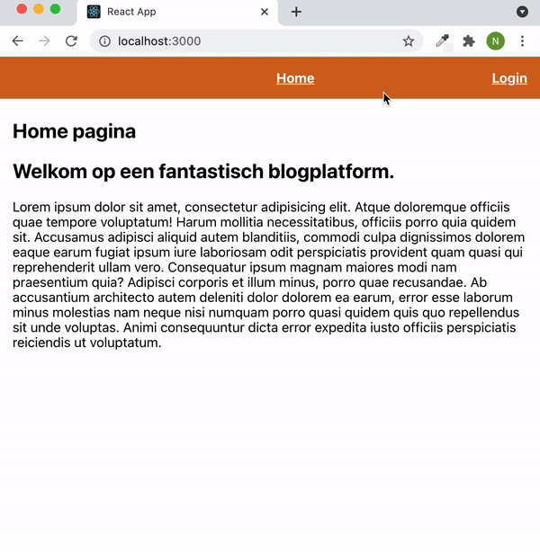

# Opdrachtbeschrijving

## Inleiding

Je gaat een bloggingplatform bouwen waarbij sommige url's niet toegankelijk zijn voor gebruikers die niet zijn ingelogd. Je gaat ook concepten als doorlinken, dynamische parameters en een nep-login toepassen. De "login"-funtionaliteit is voor deze opdracht met opzet versimpelt.



## Applicatie starten

Als je het project gecloned hebt naar jouw locale machine, installeer je eerst de `node_modules` door het volgende commando in de terminal te runnen:

```
npm install
```

Wanneer dit klaar is, kun je de applicatie starten met behulp van:

```
npm start
```

of gebruik de WebStorm knop (npm start). Open [http://localhost:3000](http://localhost:3000/) om de pagina in de browser te bekijken. Begin met het maken van wijzigingen in `src/App.js`: elke keer als je een bestand opslaat, zullen de wijzigingen te zien zijn op de webpagina.

## Opdracht 1 - routing en dynamische parameters

De blog-applicatie heeft op dit moment nog geen pagina's en ook geen routing. Dit ga jij zelf implementeren:

* Maak vier pagina-componenten aan. Zorg ervoor dat deze pagina's te bereiken zijn op de volgende *urls*:

1. Home pagina (`/`)
2. Login pagina (`/login`)
3. Blog Overzicht pagina (`/blogposts`)
4. Blogpost pagina (`/blog/:id`)

* Zorg ervoor dat er *content* op die pagina's komt te staan:
  * Maak een navigatiebalk met de links naar de Home Pagina, Login pagina en Blog Overzicht pagina. Zorg dat deze op iedere pagina te zien is.
  * De **Login pagina** bevat simpelweg een knop met "Inloggen" die de gebruiker doorstuurt naar overzichtspagina;
  * De **Blog Overzicht pagina** bevat de totale hoeveelheid posts (*getal*) en alle blog-titels. De titels zijn links die je doorlinken naar die specifieke post.
  * De **Blogpost pagina** is een component dat, op basis van de parameter in de url (*dynamic parameters*), de juiste blogpost ophaalt uit de meegeleverde JSON data, en deze weergeeft . De JSON data kun je simpelweg importeren en gebruiken als een array met objecten:

```
import posts from './data/posts.json';

function App() {
  console.log(posts);
  
  return (
    <></>
  );
}
```

## Opdracht 2 - beveiliging

Zoals je hebt gezien is er in de `App.js` een stukje state aanwezig die registreert of iemand ingelogd is of niet. Deze informatie ga je gebruiken om elementen conditioneel weer te geven, maar ook om jouw routes te beveiligen.

* Zorg ervoor dat wanneer een gebruiker op de "Inlog"-knop op de Login pagina klikt, de `isAuthenticated` state van `true` naar `false` getoggled wordt. Je zult de waarde en setter-functie (callback prop) dus vanaf `App.js` moeten doorgeven aan de pagina of component die deze waardes nodig heeft.
* Wanneer de bezoeker *niet* ingelogd is, zijn zowel de blogposts als de Blog Overzichtpagina niet te bezoeken. Dit zijn dus **private routes**!

We gaan er ook voor zorgen dat de navigatiebalk zich aanpast wanneer een gebruiker wel of niet ingelogd is:

- Wanneer de bezoeker *niet* ingelogd is, moet er een "inloggen"-link in de navigatie aanwezig zijn. Deze wijst naar de Login pagina.
- Wanneer de bezoeker *niet* ingelogd is, is de link naar de Blog Overzichtpagina *niet* aanwezig.
- Als een bezoeker *wel* ingelogd is, moet er een "uitloggen"-knop in de navigatie staan. Als je daarop klikt wordt de gebruiker direct uitgelogd en naar de home-pagina gestuurd.

## Bonus opdrachten

- Maak voor de beveiligde routes een apart `<PrivateRoute>` component voor die je kunt hergebruiken!
- Voeg een React hook form toe aan de login pagina waar de gebruiker ook daadwerkelijk gegevens kan invullen. Je kunt dan een `users.json` bestand maken met gebruikers erin, zodat je iemand daadwerkelijk kunt laten "inloggen" met een bestaand account.
- Make it look nice!